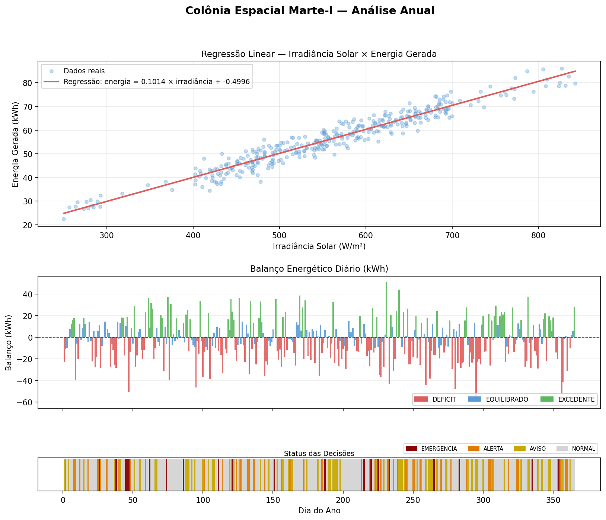

# computer_science_fiap
> Repositório do grupo contendo os projetos desenvolvidos ao longo do curso de Ciência da Computação na FIAP.
---
## Integrantes
| Nome |
|------|
| Arthur Apolonio de Oliveira |
| Matheus Bejarano da Costa Resende |
| Dayvid Daniel Duarte Ramos |
| Bryan Lima Garcia |
| Vinicius Valiati Costa |
---
## Tecnologias Utilizadas
#### Fase 1


#### Fase 2


#### Fase 3


---
## Estrutura do Repositório
```
computer_science_fiap/
├── fase1/
│   ├── Codes/
│   ├── Referencias/
│   ├── aurora_singer.ipynb
│   ├── relatorio.pdf
│   └── requirements.txt
├── fase2/
│   ├── Codes/
│   ├── Referencias/
│   ├── aurora_singer_fase2.ipynb
│   ├── code.py
│   └── relatorio.pdf
├── fase3/
│   ├── main.py
│   ├── src/
│   ├── data/
│   ├── code/
│   ├── referencias/
│   └── README.md
├── fase4/
├── fase5/
├── fase6/
└── fase7/
```
---
## Fases

### ✅ Fase 1 — Decolagem da Missão
[Acessar README da Fase 1](./fase1/README.md)

[Acessar Relatório da Fase 1](./fase1/relatorio.pdf)

Análise de **10000 leituras de telemetria** do sistema pré-decolagem da espaçonave **Aurora Siger**, validando parâmetros operacionais como temperatura, integridade estrutural, níveis de energia, pressão dos tanques e status dos módulos críticos. O projeto inclui algoritmo de verificação com classificação de status, análise energética e visualizações dos resultados.


---

### ✅ Fase 2 — Gerenciamento de Pouso (MGPEB)
[Acessar README da Fase 2](./fase2/README.md)

[Acessar Relatório da Fase 2](./fase2/relatorio.pdf)

Desenvolvimento de um **Módulo de Gerenciamento de Pouso e Estabilização de Base (MGPEB)** para a missão **Aurora Siger**, simulando a tomada de decisão em um ambiente crítico.

O projeto inclui:
- Modelagem de módulos de pouso e fila (FIFO)
- Aplicação de **lógica booleana (AND, OR, NOT)** para decisões
- Implementação de **busca linear** (menor combustível, maior prioridade)
- Ordenação com **Bubble Sort** em cenários críticos
- Simulação de estados: POUSADO / ESPERA / ALERTA
- Modelagem matemática do consumo de combustível (função exponencial)
- Integração com conceitos de **ESG e governança**


---

### ✅ Fase 3 — Gestão da Colônia Espacial (MGCE)
[Acessar README da Fase 3](./fase3/README.md)

[Acessar Relatório da Fase 3](./fase3/relatorio.pdf)

Desenvolvimento de um **Módulo de Gerenciamento da Colônia Espacial Marte (MGCE)** para a missão **Aurora Siger**, simulando um sistema inteligente de gestão energética em ambiente crítico.

O projeto inclui:
- Geração de **365 dias de leituras simuladas** da colônia (irradiância, energia, temperatura, bateria)
- Organização dos dados em **dicionários e hierarquia de sistemas**
- Análise do balanço energético diário: DEFICIT / EQUILIBRADO / EXCEDENTE
- **Regras de decisão automática** com priorização de sistemas críticos
- Classificação por status: EMERGENCIA / ALERTA / AVISO / NORMAL
- **Regressão linear simples** (mínimos quadrados) para previsão de energia gerada
- Resumo anual e detalhe de dia sorteado aleatoriamente



---

### 🚧 Fase 4 — *Em breve*
*(WIP)*
📄 [Acessar README da Fase 4](./fase4/README.md)

---

### 🚧 Fase 5 — *Em breve*
*(WIP)*
📄 [Acessar README da Fase 5](./fase5/README.md)

---

### 🚧 Fase 6 — *Em breve*
*(WIP)*
📄 [Acessar README da Fase 6](./fase6/README.md)

---

### 🚧 Fase 7 — *Em breve*
*(WIP)*
📄 [Acessar README da Fase 7](./fase7/README.md)

---

<p align="center">
  FIAP • Ciência da Computação
</p>