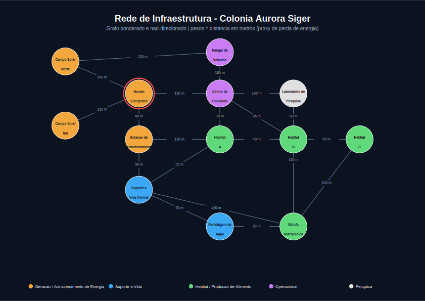

# Aurora Siger — SIGIC (Sistema Inteligente de Gerenciamento da Infraestrutura da Colônia)

Simulação de um sistema de gerenciamento da infraestrutura da colônia marciana **Aurora Siger**, utilizando grafos ponderados, algoritmos de caminhos mínimos e estruturas de dados em Python puro para otimizar a rede energética e operacional da base.

## Link do Vídeo

[[link do vídeo no YouTube](https://www.youtube.com/watch?v=y1UscGIbUqg)]

---

## Organização

    fase4/
    ├── codigo_fonte.py                      # ponto de entrada do sistema
    ├── arquivos_auxiliares/
    │   └── rede_colonia_dados.json          
    ├── referencias/
    │   ├── instrucoes_fase4.md
    │   └── img/
    │       └── rede_colonia.svg             # diagrama visual da rede/grafo
    └── relatorio.pdf                        # documentação complementar

---

## O que o sistema faz

- Modela a colônia como um **grafo ponderado e não-direcionado** com 13 módulos e 20 conexões
- Organiza os módulos em categorias funcionais:
  - Geração/armazenamento de energia
  - Suporte à vida
  - Habitats
  - Produção de alimento
  - Pesquisa e operação
- Atribui a cada módulo uma **prioridade operacional**: `CRITICA`, `ALTA` ou `MEDIA`
- Calcula caminhos mínimos entre módulos via **Dijkstra**
- Explora a conectividade da rede via **BFS** e **DFS**
- Identifica **pontos de articulação** (módulos cuja falha isolaria parte da colônia)
- Simula situações operacionais:
  - Falha de um módulo e análise de impacto na conectividade
  - Pico de consumo energético com cálculo do **fator crítico** (f*)
  - Balanço energético geral com **status interpretado** automaticamente (`SUPERAVIT`, `EQUILIBRIO` ou `DEFICIT`)
- Exporta os dados da rede para `.json`

---

## Algoritmos Utilizados

| Algoritmo | Aplicação | Complexidade |
|---|---|---|
| **Dijkstra** (com `heapq`) | Caminho de menor custo entre módulos | O((V + E) log V) |
| **BFS** (com `deque`) | Menor número de saltos entre módulos | O(V + E) |
| **DFS** (iterativo, com pilha) | Verificação de conectividade geral | O(V + E) |
| **Pontos de articulação** | Identificação de módulos críticos | O(V + E) |

---

## Estruturas de Dados Utilizadas

- `dict` → lista de adjacência do grafo (acesso O(1) aos vizinhos)
- `list` / `tuple` → vizinhos e arestas `(módulo, peso)`
- `set` → controle de nós visitados em BFS/DFS
- `heapq` → fila de prioridade do Dijkstra
- `deque` → fila da busca em largura
- `class` → encapsulamento dos atributos de cada módulo (`Modulo`): consumo, geração, status e prioridade operacional

---

## Modelagem Matemática

O sistema calcula o balanço energético geral da colônia como:

    Saldo = ΣG(v) − ΣC(v)

E modela o comportamento do saldo em função do fator de pico de consumo `f`:

    Saldo(f) = ΣG(v) − f · ΣC(v)

A derivada `dSaldo/df = −ΣC(v)` representa a taxa de queda do saldo energético por unidade de aumento no fator de pico. A partir dessa relação linear, o sistema calcula o **fator crítico**:

    f* = ΣG(v) / ΣC(v)

Esse é o ponto exato em que o saldo se anula e a colônia entra em déficit. Mais detalhes no `relatorio.pdf`.

---

## Sustentabilidade e Governança (ESG)

- **Ambiental** — geração nuclear compacta combinada com energia solar complementar, armazenamento de excedente em baterias, reciclagem de água e produção própria de alimentos
- **Social** — distribuição equitativa de energia, água e oxigênio entre os habitats, com redundância de rotas aumentando a resiliência para a tripulação
- **Governança** — uso de algoritmos de grafos (pontos de articulação e simulações de pico) como ferramenta objetiva de priorização de investimentos, reforçada pela prioridade operacional de cada módulo

---

## Como Rodar

Requer apenas Python 3 (biblioteca padrão, sem dependências externas):

    python codigo_fonte.py

Navegue pelo menu digitando o número da opção desejada.